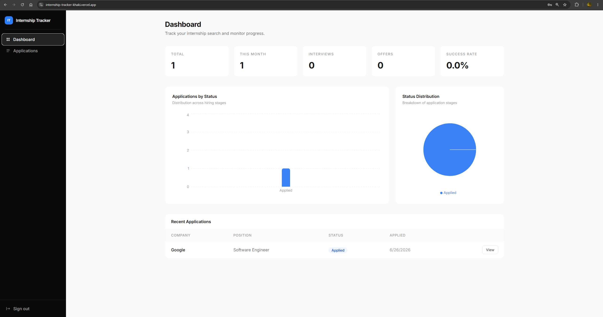
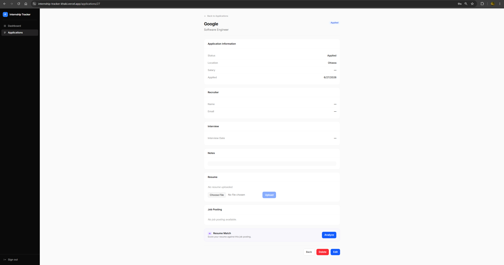
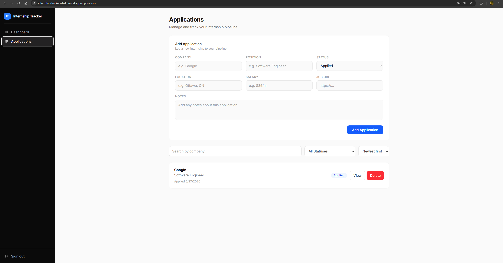
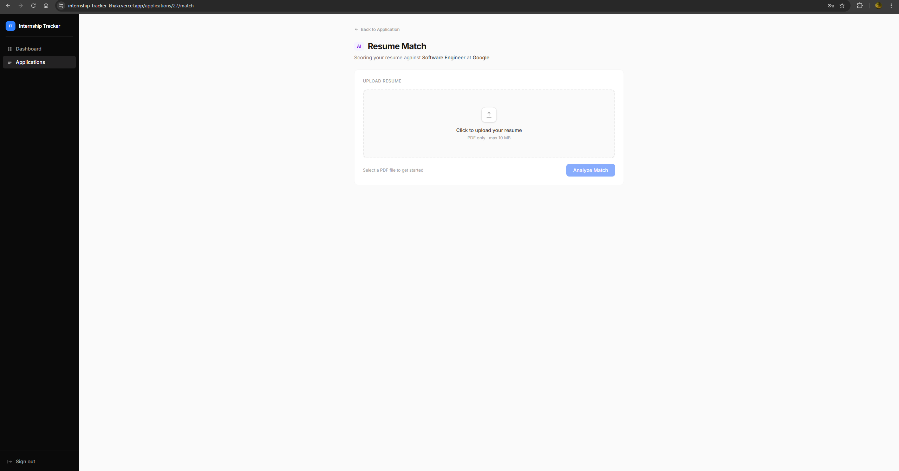

# Internship Tracker

A full-stack web app for managing internship applications
track status, recruiter contacts, interview dates, and score how well your resume matches each job description.

**[Live Demo](https://internship-tracker-khaki.vercel.app/)**

---

## Screenshots

| Dashboard | Application Detail |
|-----------|-------------------|
|  |  |

| Applications List | Resume Match |
|-------------------|--------------|
|  |  |

---

## Features

- **Application pipeline** — Add and manage applications with statuses: Interested → Applied → OA → Interview → Offer / Rejected
- **Dashboard analytics** — Bar chart, pie chart, and key stats (total, this month, interviews, offers, success rate)
- **Detailed views** — Store recruiter name/email, interview date, salary, job URL, location, and notes per application
- **Resume match scoring** — Upload a PDF resume; the app parses it and scores keyword and skill overlap against the job description, surfacing strengths and gaps
- **JWT authentication** — Secure register/login; every user's data is fully isolated

---

## Tech Stack

| Layer | Technology |
|-------|-----------|
| Frontend | React 19, TypeScript, Vite, Tailwind CSS v4, Recharts |
| Backend | Node.js, Express 5, TypeScript |
| Database | PostgreSQL |
| Auth | JWT + bcrypt |
| File handling | Multer (PDF upload), pdf-parse |
| Deployment | Vercel (frontend) · Render (backend) · Neon (DB) |

## Project Structure

```
internship-tracker/
├── backend/
│   └── src/
│       ├── controllers/        # Thin request handlers
│       ├── services/           # Business logic + raw SQL
│       ├── routes/             # Route definitions
│       ├── middleware/         # JWT auth, multer upload
│       ├── database/           # pg.Pool singleton, schema.sql, migrate.ts
│       └── utils/mapApplication.ts   # snake_case DB row → camelCase
└── frontend/
    └── src/
        ├── pages/              # Route-level components
        ├── components/         # ui/, dashboard/, auth/, layout/
        ├── services/           # apiFetch wrapper + feature services
        ├── context/            # AuthContext + useAuth hook
        └── types/              # TypeScript interfaces
```

---

## Deployment

| Service | 
|---------|
| **Vercel** (frontend)
| **Render** (backend)
| **Neon** (database)
